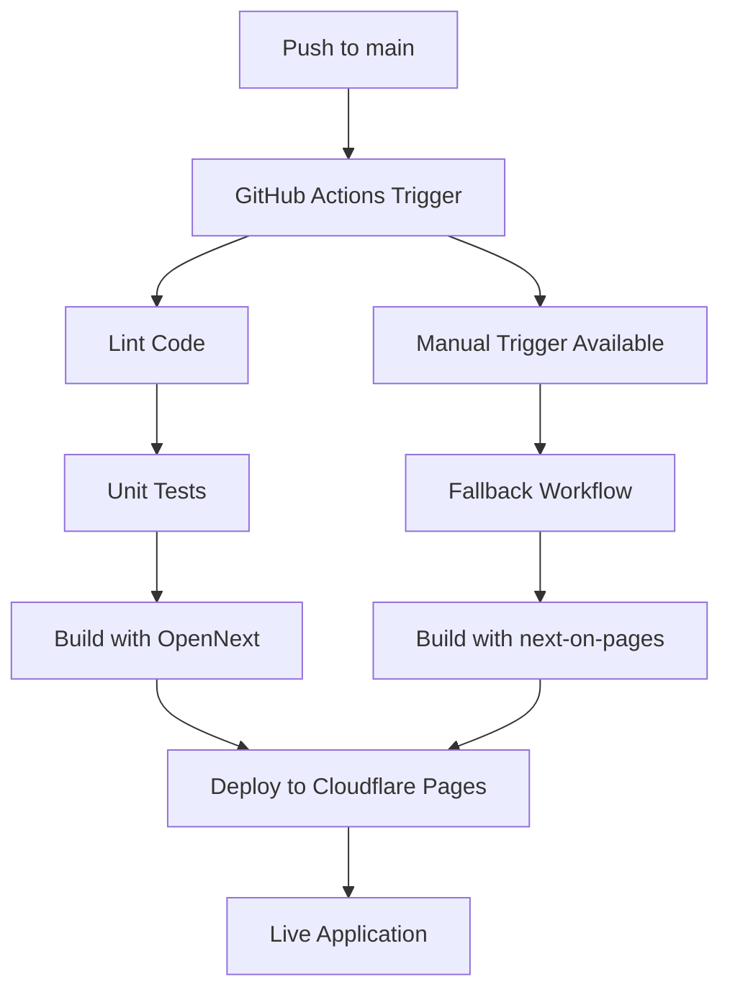

# 🚀 Cloudflare Pages Deployment Guide

Ten przewodnik opisuje proces deploymentu aplikacji Booklo na Cloudflare Pages przy użyciu GitHub Actions.

## 📋 Wymagania wstępne

### 1. Konto Cloudflare
- Utwórz konto na [Cloudflare](https://cloudflare.com)
- Przejdź do sekcji **Workers & Pages**

### 2. Tokeny API
Aby uzyskać wymagane tokeny:

#### API Token
1. Idź do [Cloudflare API Tokens](https://dash.cloudflare.com/profile/api-tokens)
2. Kliknij **"Create Token"**
3. Użyj template **"Custom token"**
4. **Permissions:**
   - Account: `Cloudflare Pages:Edit`
   - Zone: `Zone:Read` (jeśli używasz custom domain)
5. **Account Resources:** Include - All accounts
6. **Zone Resources:** Include - All zones (jeśli używasz custom domain)

#### Account ID
1. W Cloudflare Dashboard przejdź do prawego paska
2. Skopiuj **Account ID** z sekcji API

### 3. Konfiguracja GitHub Secrets

W repozytorium GitHub dodaj następujące secrets (`Settings` → `Secrets and variables` → `Actions`):

#### 🔑 Cloudflare Secrets
```
CLOUDFLARE_API_TOKEN=your-cloudflare-api-token
CLOUDFLARE_ACCOUNT_ID=your-cloudflare-account-id
```

#### 🗄️ Supabase Secrets
```
NEXT_PUBLIC_SUPABASE_URL=https://your-project.supabase.co
NEXT_PUBLIC_SUPABASE_ANON_KEY=your-supabase-anon-key
SUPABASE_URL=https://your-project.supabase.co
SUPABASE_ANON_KEY=your-supabase-anon-key
SUPABASE_SERVICE_ROLE_KEY=your-supabase-service-role-key
```

#### 🤖 OpenAI Secrets
```
OPENAI_API_KEY=sk-proj-your-openai-api-key
```

#### 🌐 Site Configuration
```
NEXT_PUBLIC_SITE_URL=https://your-domain.pages.dev
```

## 🔄 Proces Deploymentu

### Automatyczny Deployment
Aplikacja zostanie automatycznie wdrożona po każdym push do brancha `main`:

1. **Lint Code** - Sprawdzenie jakości kodu
2. **Unit Tests** - Uruchomienie testów jednostkowych
3. **Build & Deploy** - Budowa aplikacji i deployment na Cloudflare

### Ręczny Deployment
Możesz również uruchomić deployment ręcznie:

1. Idź do zakładki **Actions** w repozytorium
2. Wybierz workflow **"Deploy to Cloudflare Pages"**
3. Kliknij **"Run workflow"**

### Fallback Deployment
W przypadku problemów z głównym deploymentem:

1. Użyj workflow **"Deploy to Cloudflare Pages (Fallback)"**
2. Tego workflow używa tradycyjnego podejścia `@cloudflare/next-on-pages`

## 📁 Struktura Workflow'ów

### 🎯 Główny Workflow (`master.yml`)
- Używa `@opennextjs/cloudflare` (nowoczesne podejście)
- Automatyczny trigger na push do `main`
- Pełny pipeline: Lint → Test → Deploy

### 🔄 Fallback Workflow (`master-fallback.yml`)
- Używa `@cloudflare/next-on-pages` (tradycyjne podejście)
- Tylko ręczny trigger
- Dla przypadków gdy główny workflow nie działa

### 🧩 Kompozytowa Akcja (`setup-node-deps`)
- Wspólna akcja dla setup Node.js i instalacji zależności
- Redukuje duplikację kodu w workflow'ach

## 🏗️ Architektura Deploymentu



## 🔧 Konfiguracja Lokalna

### Development
```bash
npm run dev
```

### Preview Cloudflare Build
```bash
# Główne podejście
npm run preview

# Tradycyjne podejście (fallback)
npm run preview:traditional
```

### Manual Deploy
```bash
# Główne podejście
npm run deploy

# Wygenenerowanie typów Cloudflare
npm run cf:typegen
```

## 🐛 Troubleshooting

### Problem 1: Build Failed
**Błąd:** `npm ci` dependency conflicts

**Rozwiązanie:**
1. Sprawdź plik `.npmrc` - powinien zawierać `legacy-peer-deps=true`
2. Zaktualizuj `package-lock.json`:
   ```bash
   rm package-lock.json
   npm install
   ```

### Problem 2: Environment Variables
**Błąd:** Missing environment variables

**Rozwiązanie:**
1. Sprawdź wszystkie secrets w GitHub
2. Upewnij się, że używasz environment `production` w workflow

### Problem 3: Deployment Timeout
**Błąd:** Wrangler deploy timeout

**Rozwiązanie:**
1. Użyj fallback workflow z `@cloudflare/next-on-pages`
2. Sprawdź rozmiar build'a - może być za duży

### Problem 4: Function Runtime Error
**Błąd:** Function threw error at runtime

**Rozwiązanie:**
1. Sprawdź compatibility flags w Cloudflare Dashboard
2. Dodaj `nodejs_compat` flag w ustawieniach projektu

## 📊 Monitoring

### GitHub Actions
- Sprawdzaj workflow status w zakładce **Actions**
- Job summary zawiera szczegółowe informacje o deploymencie

### Cloudflare Dashboard
- Monitor function logs w **Workers & Pages**
- Analytics dostępne w sekcji projektu

## 🔄 Updates

### Aktualizacja Dependencies
```bash
npm update @opennextjs/cloudflare wrangler
```

### Aktualizacja GitHub Actions
- Actions są automatycznie aktualizowane do najnowszych major versions
- Sprawdzaj [GitHub Marketplace](https://github.com/marketplace?type=actions) dla nowych wersji

## 📚 Dodatkowe Zasoby

- [Cloudflare Pages Documentation](https://developers.cloudflare.com/pages/)
- [OpenNext Cloudflare Documentation](https://opennext.js.org/cloudflare)
- [Next.js on Cloudflare Pages](https://developers.cloudflare.com/pages/framework-guides/nextjs/)
- [GitHub Actions Documentation](https://docs.github.com/en/actions) 